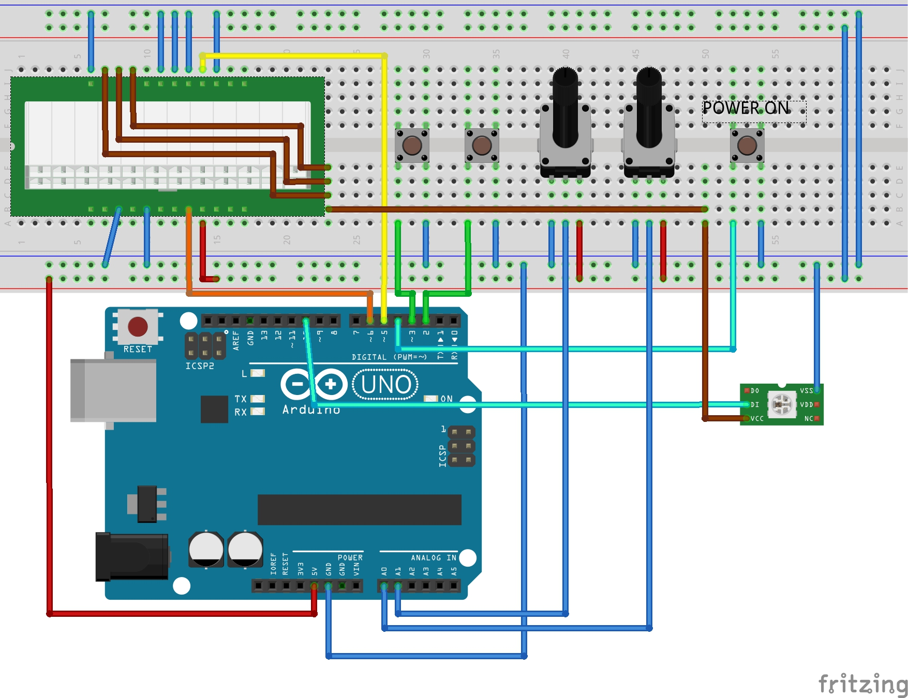

# PongHaum

## Qu'est-ce que c'est ?

Ce dépôt contient les sources de ponghaum, le pong 1D réalisé par le HAUM (http://haum.org/)

## Arduino

### Présentation

Le système utilise 150 leds en bande commandées par la bibliothèque FastLED et deux boutons. Les détails du système est/sera présent sur le site du HAUM.

### Paramétrage

Le paramétrage des pins de l'arduino est réalisé dans le fichier khroma.h avec les constances PINS__*.

Par défaut, les boutons sont reliés aux entrées 2 et 3 et le bandeau de LEDs est relié à la sortie 10.
L'arduino est reliée à une alimentation ATX. Un bouton poussoir POWERSTOP (4) permet de commander l'extinction, une broche POWERCMD (5) est reliée à la commande d'allumage de l'ATX (fil vert) et une broche POWERGOOD (6) permet de détecter l'allumage de l'alimentation.



### Compilation

Lorsque le dépôt est cloné, il faut penser à charger les submodules pour avoir les dépendances permettant de construire le programme pour Arduino.

```
git submodule init
git submodule update
```

Ensuite il est possible d'utiliser le Makefile pour envoyer le programme sur Arduino :

```
make upload
```

Testé avec Arduino 1.0.6

Have fun :)

## Émulateur

### Contôles

Les boutons sont émulés par des touches de calvier :

 - Flèche Gauche ou touche Q sur clavier AZERTY = bouton 1
 - Flèche Droite ou touche D sur clavier AZERTY = bouton 2

Une touche permet aussi de quitter l'émulateur :

 - Échap = Quitter l'émulateur

Les leds sont émulés par des pixels dans une fenêtre.

Les caractères envoyés sur la liaison série sont redirigés vers la sortie standard du programme.

### Raison d'être

Les sources contiennent un émulateur pour le développement et tests sur PC.

Celui-ci permet d'essayer différents programmes sans avoir accès au système électronique, en cours de construction lors de la création du dépôt.
Il faut néanmoins garder en tête que la cible principale est un microcontrôleur 8 bits avec assez peu de mémoire vive.

### Compilation

Le Makefile permet de construire l'émulateur PC (bibliothèque SDL2 nécessaire) :

```
make pc
```

Les dépendances sont seulement pthread et SDL2.

Attention, la variable d'environnement ARDUINO_DIR doit être non nulle (même si elle n'est pas rellement utilisée dans ce cas)

## Licence

Le projet est fourni sous licence MIT.

C'est une licence libre qui vous permet par exemple :
 - de le copier,
 - de l'étudier,
 - de l'adapter à vos besoins,
 - de le redistribuer

Nous vous encourageons vivement à forker et partager !
